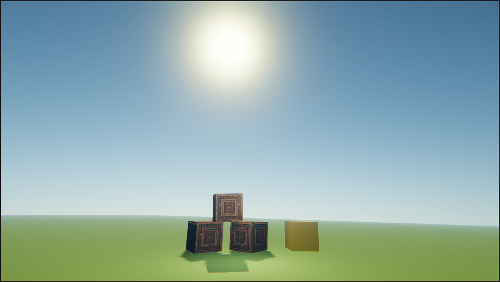
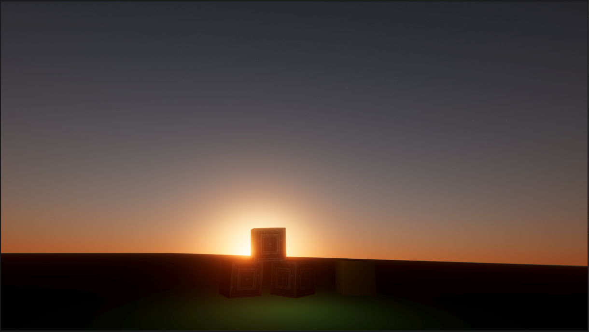
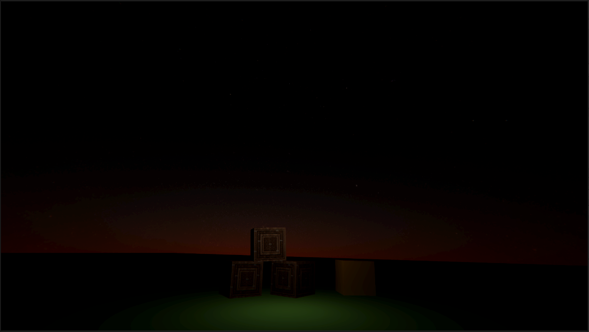
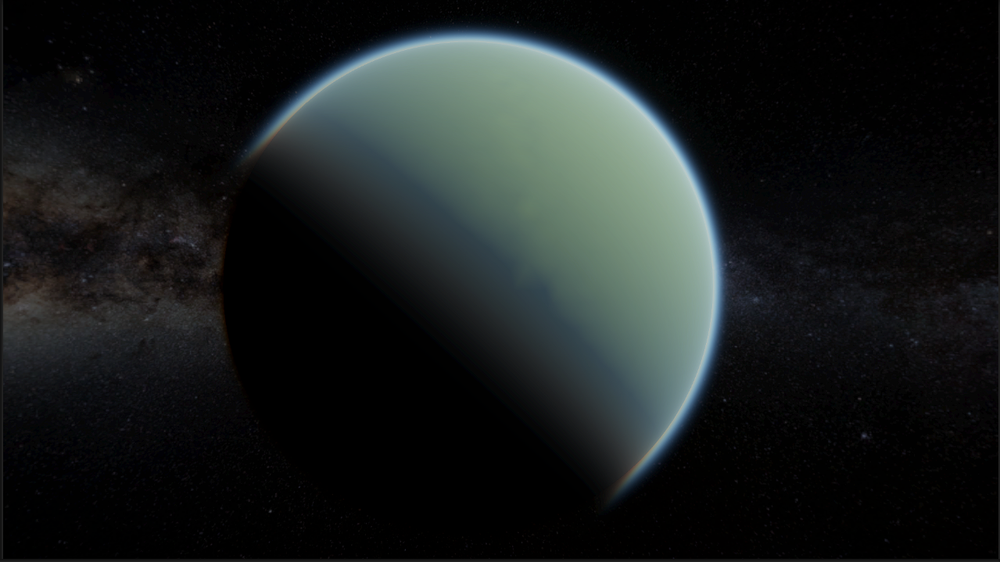
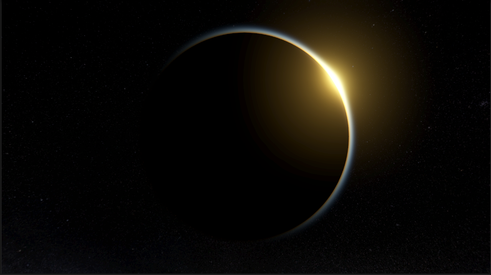
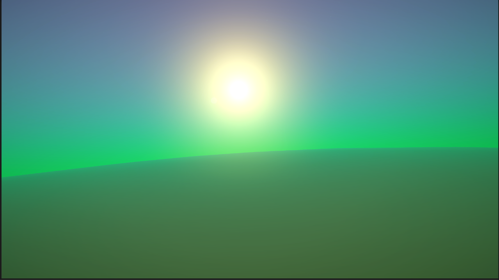
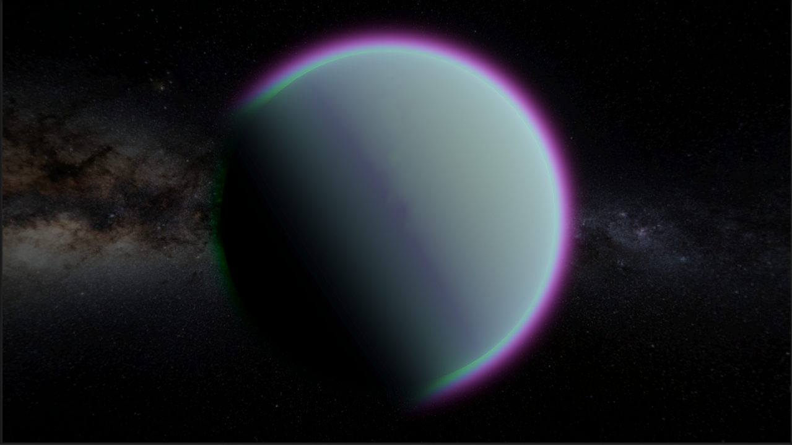
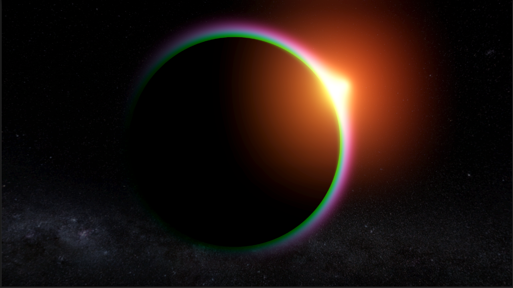

# Atmospheric Scattering For Unity's Universal RP

Open Source (MIT) implementation of an atmospheric scattering example I found here : https://www.shadertoy.com/view/wlBXWK.

Ported to HLSL and Unity's Universal RP.

### Features
* Atmospheric Scattering Render Feature.
* Atmospheric Scattering Settings ScriptbleObject.
* Atmospheric Scattering Effect Behaviour.
* Modified to work with Baked Optical Depth, inspired by Sebastian Lague's video on Atmospheric Rendering found here: https://www.youtube.com/watch?v=DxfEbulyFcY.

### Usage

* Add the Atmosphere Render Feature to the current active renderer.
* Create a new AtmosphereSettings scriptableObject by right-clicking/Create/Atmosphere/Atmosphere Profile.
* Add an AtmosphereEffect component to an object in your scene.
* Assign the Atmosphere Settings created earlier to the Atmosphere Effect component.
* Tweak the planet/ocean radius and atmosphere scale to appropriate values. Use the example scene as reference for working values.

There is currently no hard limit on amount of active effects allowed in any given scene, but it is best to reduce the amount as much as possible

### Optional

If the scene is using a URP camera stack with the explicit purpose of increasing view distance/maintianing depth precision:
* Add the Depth Stack render feature to your current active renderer.
* Make sure your overlay camera is set to clear depth.
* Atmosphere will automatically use the far camera's depth buffer when needed, increasing the effect's render distance.

### Potential issues/Requirements
* Not tested with VR/AR
* Earlier versions of URP have shown issues with the Depth Stack not working properly
* Requires compute shader support on active platform.
* Tried to pre-bake Optical Depth values into Texture3D's on the CPU- Did not work in shader.
* Tested on Linux and Windows machines with Unity 2022. Mac, Mobile, and other platforms are untested.
* Orthographic cameras work- but effect is much more potent visually and settings may require tweaking to prevent scene objects from being washed out

### Limitations
* Each active effect supports only one main light. Can be easily modified to use more lights, potentially for multiple suns/moons.
* Does not suppport having a positional sun for mie glow- If you have a sun model in the scene, the mie glow inside the atmosphere will not correctly represent the position of the object

### Example Scene with Default Earthlike profile
* Atmosphere at daytime- default profile with point light added for faux ambient lighting
 
* Atmosphere at sunset- tweaked absorbtion values to look redder
 
* Atmosphere at near-nighttime- tweaked absorbtion values to look redder
 
* Atmosphere from space- side view with default profile
 
* Atmosphere and planet forming eclipse- default profile showing some mie glow along the edge
 

### Example Scene with Exoplanet Atmosphere profile
* Exoplanet atmosphere at daytime
 
* Exoplanet atmosphere from space
 
* Exoplanet forming eclipse
 
